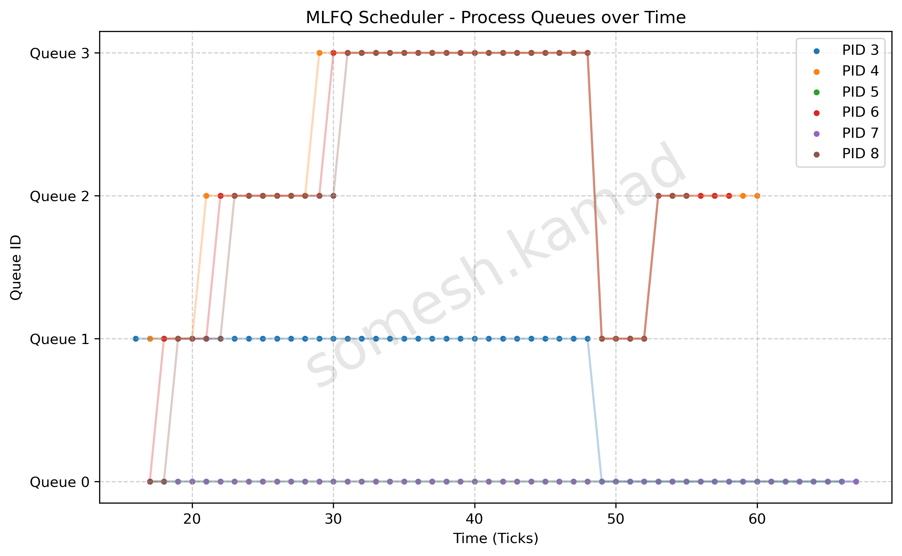

# MLFQ & Cross-Scheduler Comparison Report

## 2.3.1 Implementation Summary

- **Makefile / SCHEDULER macro:** Added `SCHEDULER` macro flags in the Makefile to easily switch between MLFQ, FIFO, and RR by conditionally defining `-DMLFQ` and `-DFIFO` via `CFLAGS`. Modified CPUS to 1 for accurate benchmarking.
- **struct proc changes:** Added `queue` and `ticks` under `#ifdef MLFQ` to track the process priority and time slice spent in that queue. Also added `ctime`, `rtime`, `iotime`, `etime`, and `first_run_time` for scheduler metrics calculation.
- **allocproc() changes:** Initialized `p->queue = 0` and `p->ticks = 0`. Also initialized all timing metrics for Turnaround/Waiting/Response time calculations on allocation.
- **queue selection/preemption logic:** Handled in `scheduler()` by replacing the linear scan with a priority-based multi-level queue array (`mlfq[4][NPROC]`). Queues are guarded by `mlfq_lock`. Highest priority queues are checked first and `p->state == RUNNABLE` is verified before executing. Preemption from a higher queue arriving is checked inside `yield()`.
- **time-slice handling:** On a timer interrupt (in `trap.c`), `yield()` is called. In `yield()`, the process's `ticks` in its current queue are checked against the limits (1, 4, 8, 16). If it exceeds the quantum, it gets preempted, moves down a queue level, and its ticks reset to 0.
- **voluntary yield handling:** If a process gives up CPU via `sleep()`, its ticks are reset. When woken up via `wakeup()`, it's placed back at the tail of the same queue (`p->queue` remains unchanged), successfully maintaining its priority level.
- **priority boosting:** Implemented in `trap.c` inside `clockintr()` by calling `boost_priority()` every 48 ticks. The boost safely locks `mlfq_lock` and the individual process locks to avoid deadlocks, resetting all processes to `queue 0` and `ticks 0`.
- **procdump changes:** Extends `procdump()` (`ctrl+p`) by printing `p->queue` and `p->ticks` alongside the normal debugging data.

## 2.3.2 MLFQ Analysis

The python script `plot_mlfq.py` successfully parses `MLFQ_PLOT` traces dumped from the scheduler logic to generate a scatter plot / timeline of processes.
The plot clearly showcases CPU-bound processes migrating from queue 0 downwards into queue 3 due to exhausting their progressively increasing time-slices, while I/O bound tasks remain in higher priority queues (queue 0). Every 48 ticks, you can visibly observe all active processes instantly migrating back up to Queue 0, demonstrating the anti-starvation priority boost correctly executing and preventing CPU-bound tasks from languishing in queue 3 indefinitely.

## 2.3.3 Comparison Results

| Metric | FIFO | Round Robin (RR) | MLFQ |
| --- | --- | --- | --- |
| **Average Turnaround Time** | 154.0 ticks | 44.2 ticks | 41.4 ticks |
| **Average Waiting Time** | 108.0 ticks | 30.0 ticks | 17.6 ticks |
| **Average Response Time** | 108.0 ticks | 2.0 ticks | 2.4 ticks |

*Note: Benchmarks were run using 3 CPU-bound processes and 2 I/O-bound processes on a single CPU core.*

### Trade-offs Observed
As seen in the data, **FIFO** heavily suffers from the "Convoy Effect" — long CPU-bound tasks execute to completion before anything else can run, resulting in disastrously high Average Waiting (108 ticks) and Response times. **Round Robin** optimally solves the response time issue (2 ticks) by rapidly context switching between all processes, though its average waiting time climbs slightly higher than MLFQ because processes constantly cycle in and out of the CPU. **MLFQ** achieves the best overall Turnaround and Waiting times by merging the best of both worlds: it grants instant execution to I/O-bound processes (keeping response time low), but allows CPU-bound processes to run for successively longer uninterrupted bursts in lower queues, reducing the overhead of context switching while still avoiding the convoy effect.
